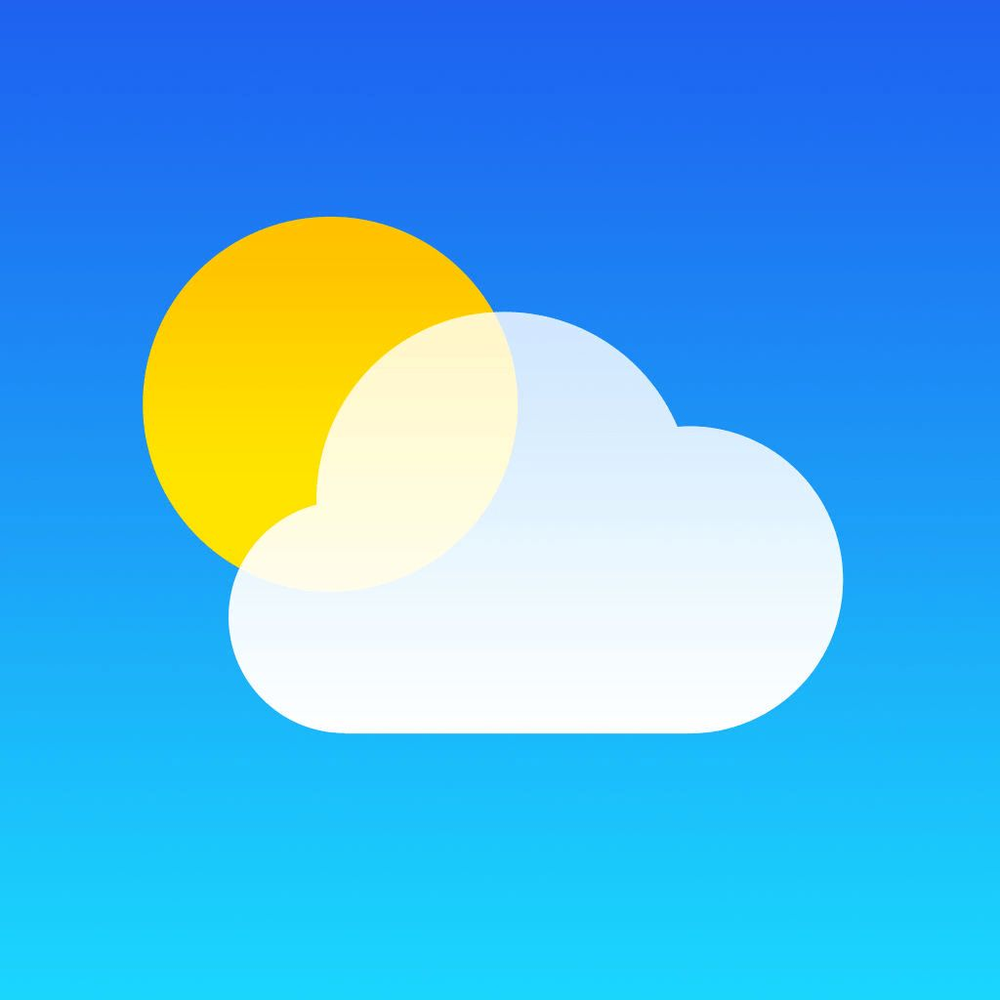

<!-- Improved compatibility of back to top link: See: https://github.com/othneildrew/Best-README-Template/pull/73 -->

<a id="readme-top"></a>

<!--
*** Thanks for checking out the Best-README-Template. If you have a suggestion
*** that would make this better, please fork the repo and create a pull request
*** or simply open an issue with the tag "enhancement".
*** Don't forget to give the project a star!
*** Thanks again! Now go create something AMAZING! :D
-->

<!-- PROJECT SHIELDS -->
<!--
*** I'm using markdown "reference style" links for readability.
*** Reference links are enclosed in brackets [ ] instead of parentheses ( ).
*** See the bottom of this document for the declaration of the reference variables
*** for contributors-url, forks-url, etc. This is an optional, concise syntax you may use.
*** https://www.markdownguide.org/basic-syntax/#reference-style-links
-->

[![Contributors][contributors-shield]][contributors-url]
[![Forks][forks-shield]][forks-url]
[![Stargazers][stars-shield]][stars-url]
[![Issues][issues-shield]][issues-url]
[![project_license][license-shield]][license-url]
[![LinkedIn][linkedin-shield]][linkedin-url]

<!-- PROJECT LOGO -->
<br />
<div align="center">
  <a href="https://github.com/ayemteezy/weather-app">
    
  </a>

<h3 align="center">Odin Weather App</h3>

  <p align="center">
    A browser-based Weather App built as part of The Odin Project curriculum (Full Stack JavaScript path). The focus of this project is fetching and displaying live data from an external API, handling async requests, and structuring a multi-module app with Webpack.
    <br />
    <a href="https://github.com/ayemteezy/weather-app"><strong>Explore the docs »</strong></a>
    <br />
    <br />
    <a href="https://teezy-weatherapp.netlify.app/">View Demo</a>
    &middot;
    <a href="https://github.com/ayemteezy/weather-app/issues/new?labels=bug&template=bug-report.md">Report Bug</a>
    &middot;
    <a href="https://github.com/ayemteezy/weather-app/issues/new?labels=enhancement&template=feature-request.md">Request Feature</a>
  </p>
</div>

<!-- TABLE OF CONTENTS -->
<details>
  <summary>Table of Contents</summary>
  <ol>
    <li>
      <a href="#about-the-project">About The Project</a>
      <ul>
        <li><a href="#built-with">Built With</a></li>
      </ul>
    </li>
    <li>
      <a href="#getting-started">Getting Started</a>
      <ul>
        <li><a href="#prerequisites">Prerequisites</a></li>
        <li><a href="#installation">Installation</a></li>
      </ul>
    </li>
    <li><a href="#usage">Usage</a></li>
    <li><a href="#roadmap">Roadmap</a></li>
    <li><a href="#contributing">Contributing</a></li>
    <li><a href="#license">License</a></li>
    <li><a href="#contact">Contact</a></li>
    <li><a href="#acknowledgments">Acknowledgments</a></li>
  </ol>
</details>

<!-- ABOUT THE PROJECT -->

## About The Project

[![Weather App Screen Shot][product-screenshot]](https://teezy-weatherapp.netlify.app/)

This project is part of [The Odin Project](https://www.theodinproject.com/lessons/node-path-javascript-weather-app)'s JavaScript course. The goal was to build a weather app that fetches real-time data from a third-party API and renders it dynamically, using the **module pattern** to separate API calls, data parsing, and DOM rendering, and **Webpack** to bundle everything (including a hidden API key via environment variables).

The application features:

- Search for current weather and a multi-day forecast by city name
- Async data fetching using the Fetch API and `async/await`, with graceful error handling for invalid locations or failed requests
- Toggle between Fahrenheit and Celsius without re-fetching data
- Dynamic display of temperature, conditions, humidity, wind speed, and a matching weather icon
- Loading state while data is being fetched
- Responsive layout that adapts to mobile and desktop screens

This project emphasizes working with external APIs, Promises and `async/await`, environment variables/API key management with Webpack, and rendering asynchronous data without blocking the UI.

<p align="right">(<a href="#readme-top">back to top</a>)</p>

### Built With

- [![HTML5][HTML5]][HTML5-url]
- [![CSS3][CSS3]][CSS3-url]
- [![JavaScript][JavaScript]][JavaScript-url]
- [![Webpack][Webpack]][Webpack-url]

<p align="right">(<a href="#readme-top">back to top</a>)</p>

<!-- GETTING STARTED -->

## Getting Started

To get a local copy up and running, follow these steps.

### Prerequisites

You'll need Node.js and npm installed, plus a free API key from a weather data provider (e.g. [Visual Crossing](https://www.visualcrossing.com/) or [OpenWeather](https://openweathermap.org/)).

```sh
npm install npm@latest -g
```

### Installation

1. Clone the repo

1. Get a free API key from your chosen weather provider
1. Clone the repo

```sh
git clone https://github.com/ayemteezy/weather-app.git
```

3. Install NPM packages

```sh
npm install
```

4. Create a `.env` file in the project root and add your API key

```sh
API_KEY=your_api_key_here
```

5. Run the development server

```sh
npm run start
```

6. Or build for production

```sh
npm run build
```

<p align="right">(<a href="#readme-top">back to top</a>)</p>

<!-- USAGE EXAMPLES -->

## Usage

1. Type a city or location into the search bar and press enter (or click "Search")
2. The app fetches current conditions and displays temperature, weather description, and an icon
3. Scroll or view the forecast section for the upcoming days' outlook
4. Click the °F / °C toggle to switch units instantly
5. If the location can't be found, an error message prompts you to try again

<p align="right">(<a href="#readme-top">back to top</a>)</p>

<!-- ROADMAP -->

## Roadmap

- [x] Fahrenheit/Celsius toggle
- [x] Search by city name
- [x] Current conditions display
- [x] Error handling for invalid searches
- [x] Hourly forecast view

See the [open issues](https://github.com/ayemteezy/weather-app/issues) for a full list of proposed features (and known issues).

<p align="right">(<a href="#readme-top">back to top</a>)</p>

<!-- CONTRIBUTING -->

## Contributing

Contributions are what make the open source community such an amazing place to learn, inspire, and create. Any contributions you make are **greatly appreciated**.

If you have a suggestion that would make this better, please fork the repo and create a pull request. You can also simply open an issue with the tag "enhancement".
Don't forget to give the project a star! Thanks again!

1. Fork the Project
2. Create your Feature Branch (`git checkout -b feature/AmazingFeature`)
3. Commit your Changes (`git commit -m 'Add some AmazingFeature'`)
4. Push to the Branch (`git push origin feature/AmazingFeature`)
5. Open a Pull Request

<p align="right">(<a href="#readme-top">back to top</a>)</p>

### Top contributors:

<a href="https://github.com/ayemteezy/weather-app/graphs/contributors">
  
</a>

<!-- LICENSE -->

## License

Distributed under the MIT License. See `LICENSE` for more information.

<p align="right">(<a href="#readme-top">back to top</a>)</p>

<!-- CONTACT -->

## Contact

- Twitter/X: [@ayemteezy\_](https://x.com/ayemteezy_)
- Email: [laurencelestercarino@gmail.com](mailto:laurencelestercarino@gmail.com)
- GitHub: [ayemteezy](https://github.com/ayemteezy)

Project Link: [https://github.com/ayemteezy/weather-app](https://github.com/ayemteezy/weather-app)

<p align="right">(<a href="#readme-top">back to top</a>)</p>

<!-- ACKNOWLEDGMENTS -->

## Acknowledgments

- [The Odin Project](https://www.theodinproject.com/) — for the project brief and curriculum
- [Visual Crossing Weather API](https://www.visualcrossing.com/) — for weather data
- [Google Fonts](https://fonts.google.com/) — for typography
- [contrib.rocks](https://contrib.rocks) — contributor image generator

<p align="right">(<a href="#readme-top">back to top</a>)</p>

<!-- MARKDOWN LINKS & IMAGES -->
<!-- https://www.markdownguide.org/basic-syntax/#reference-style-links -->

[contributors-shield]: https://img.shields.io/github/contributors/ayemteezy/tic-tac-toe.svg?style=for-the-badge
[contributors-url]: https://github.com/ayemteezy/weather-app/graphs/contributors
[forks-shield]: https://img.shields.io/github/forks/ayemteezy/tic-tac-toe.svg?style=for-the-badge
[forks-url]: https://github.com/ayemteezy/weather-app/network/members
[stars-shield]: https://img.shields.io/github/stars/ayemteezy/tic-tac-toe.svg?style=for-the-badge
[stars-url]: https://github.com/ayemteezy/weather-app/stargazers
[issues-shield]: https://img.shields.io/github/issues/ayemteezy/tic-tac-toe.svg?style=for-the-badge
[issues-url]: https://github.com/ayemteezy/weather-app/issues
[license-shield]: https://img.shields.io/github/license/ayemteezy/tic-tac-toe.svg?style=for-the-badge
[license-url]: https://github.com/ayemteezy/weather-app/blob/main/LICENSE
[linkedin-shield]: https://img.shields.io/badge/-LinkedIn-black.svg?style=for-the-badge&logo=linkedin&colorB=555
[linkedin-url]: https://www.linkedin.com/in/laurence-lester-cari%C3%B1o/
[product-screenshot]: src/assets/images/screenshot.png

<!-- Shields.io badges. You can a comprehensive list with many more badges at: https://github.com/inttter/md-badges -->

[HTML5]: https://img.shields.io/badge/HTML5-E34F26?style=for-the-badge&logo=html5&logoColor=white
[HTML5-url]: https://developer.mozilla.org/en-US/docs/Web/HTML
[CSS3]: https://img.shields.io/badge/css3-%23663399?style=for-the-badge&logo=css&logoColor=white
[CSS3-url]: https://developer.mozilla.org/en-US/docs/Web/CSS
[JavaScript]: https://img.shields.io/badge/javascript-%23F7DF1E?style=for-the-badge&logo=javascript&logoColor=black
[JavaScript-url]: https://developer.mozilla.org/en-US/docs/Web/JavaScript
[Webpack]: https://img.shields.io/badge/webpack-%238DD6F9?style=for-the-badge&logo=webpack&logoColor=black
[Webpack-url]: https://webpack.js.org/
